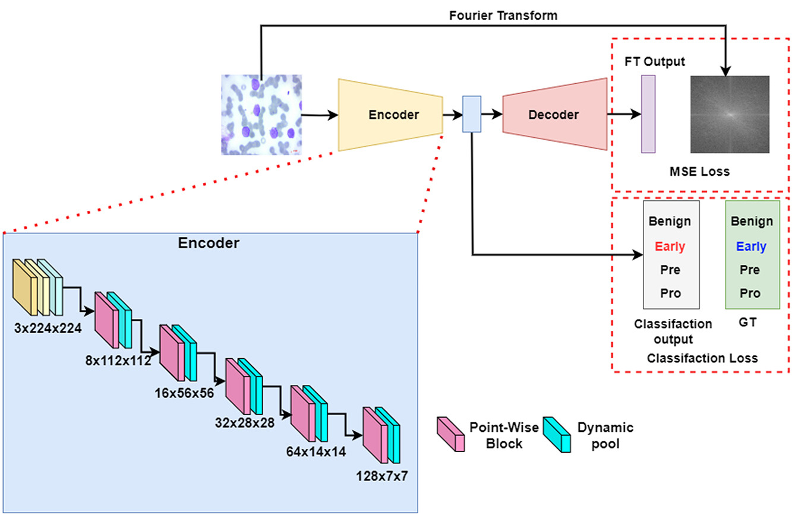
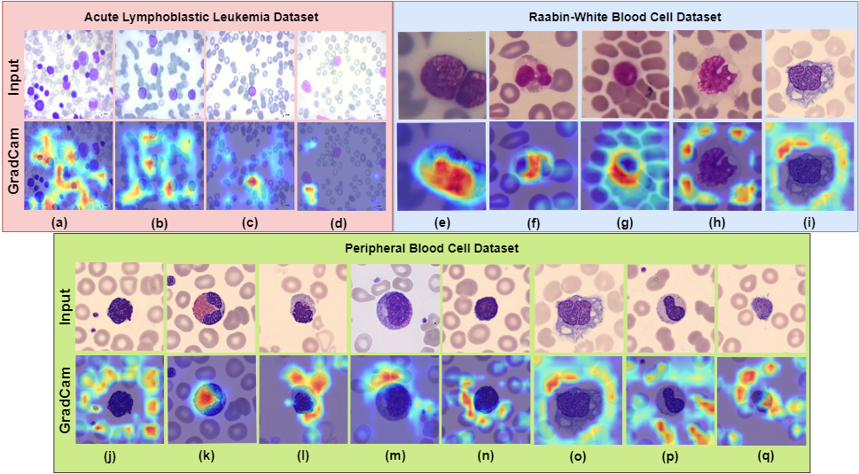
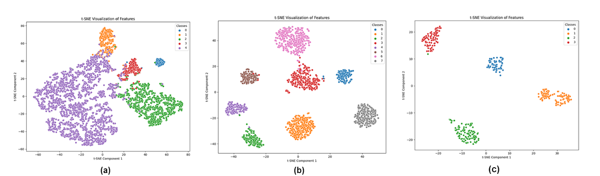

# FDP-Net: Fourier transform guided lightweight depthwise and pointwise Dynamic Pooling based Neural Network for Medical Image Classification

[](https://doi.org/10.1016/j.asoc.2025.113824)  
[](LICENSE)  

Official implementation of the paper:  
> **FDP-Net: Fourier transform guided lightweight depthwise and pointwise dynamic pooling based neural network for medical image classification**  
> *Asfak Ali, Rajdeep Pal, Aishik Paul, Ram Sarkar*  
> Published in *Applied Soft Computing, Elsevier, 2025*  

---

## 🔬 Overview  

FDP-Net is a **lightweight deep learning model** for medical image classification.  
Key contributions:  

- **Depthwise and Pointwise Feature Fusion (DPFF) Block** for efficient feature extraction.  
- **Dynamic Pooling** – a learnable alternative to traditional max pooling.  
- **Fourier Transform (FT) Guidance** with multi-task loss for faster convergence and reduced overfitting.



The model achieves **state-of-the-art performance** while keeping parameters as low as **0.349M**, making it suitable for resource-constrained clinical environments.  

---

## 📊 Results  

| Dataset       | Accuracy (%) | Parameters |
|---------------|-------------|------------|
| ALL (Leukemia) | **100.0**   | 0.349M |
| PBC            | **98.13**   | 0.349M |
| Raabin-WBC     | **96.79**   | 0.349M |


---

## 📦 Datasets  

We trained and evaluated **FDP-Net** on three publicly available medical imaging datasets:  

- 🧬 **[ALL Dataset (Acute Lymphoblastic Leukemia)](https://www.kaggle.com/datasets/mehradaria/leukemia)**  
  - 3,256 microscopic blood smear images  
  - Two classes: benign vs. malignant (Early Pre-B, Pre-B, Pro-B)  

- 🩸 **[Peripheral Blood Cell (PBC) Dataset](https://www.kaggle.com/datasets/unclesamulus/blood-cells-image-dataset)**  
  - 17,092 images of 8 different normal blood cell types  
  - Captured using the CellaVision DM96 analyzer  

- 🔬 **[Raabin-WBC Dataset](https://www.kaggle.com/datasets/masoudnickparvar/white-blood-cells-dataset)**  
  - 14,514 images of leukocytes (lymphocytes, neutrophils, monocytes, eosinophils, basophils)  
  - Collected from 73 peripheral blood films  

Each dataset was split into **train / validation / test** sets as described in the paper.  
Data preprocessing included resizing to `224x224`, normalization to `[0,1]`, and augmentations (rotation, flips).  

---

## 📈 Visualization  

To better understand model behavior, we used **interpretability techniques**:  

- 🔥 **Grad-CAM**  
  - Highlights regions of the blood cell image that contributed most to the classification decision.  
  - Helps verify that FDP-Net focuses on medically relevant features.
 
    

- 🎨 **t-SNE Plots**  
  - Visualize high-dimensional feature embeddings in 2D space.  
  - Show clear separation of different blood cell classes, indicating strong feature learning.
 
    

  - a) t-SNE for the Raabin-WBC dataset for combined (phase and magnitude), (b) t-SNE for the PBC dataset for phase, (c) t-SNE for the ALL dataset for magnitude
 
 ---

 ## ✨ Citation  

If you use this work, please cite our paper:  

```bibtex
@article{ali2025fdp,
  title={FDP-Net: Fourier transform guided lightweight depthwise and pointwise dynamic pooling based neural network for medical image classification},
  author={Ali, Asfak and Pal, Rajdeep and Paul, Aishik and Sarkar, Ram},
  journal={Applied Soft Computing},
  pages={113824},
  year={2025},
  publisher={Elsevier}
}
```
---

## 👩‍💻 Authors  

- **Asfak Ali**  
  Department of Electronics and Telecommunication Engineering, Jadavpur University, Kolkata  
  📧 [asfakali.etce.rs@jadavpuruniversity.in](mailto:asfakali.etce.rs@jadavpuruniversity.in)  

- **Rajdeep Pal**  
  Department of Artificial Intelligence and Machine Learning, St. Thomas College of Engineering and Technology, Kolkata  
  📧 [rajdeeppal167@gmail.com](mailto:rajdeeppal167@gmail.com)  

- **Aishik Paul**  
  Department of Electronics and Communication Engineering, Heritage Institute of Technology, Kolkata  
  📧 [aishik.paul.ece26@heritageit.edu.in](mailto:aishik.paul.ece26@heritageit.edu.in)  

- **Ram Sarkar**  
  Department of Computer Science and Engineering, Jadavpur University, Kolkata  
  📧 [ram.sarkar@jadavpuruniversity.in](mailto:ram.sarkar@jadavpuruniversity.in)  

---

## ⚠️ Disclaimer  

This repository and code are intended for **research purposes only**.  
They are **not a substitute for professional medical advice, diagnosis, or treatment**.  

👉 FDP-Net should only be used as a **clinical decision support tool** under the supervision of qualified healthcare professionals.  
The authors and contributors are **not responsible** for any misuse of this code in real-world clinical settings.  


