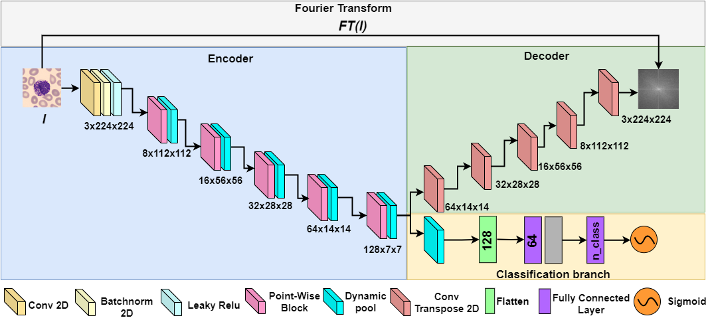

# FDP-Net: Fourier transform guided lightweight depthwise and pointwise Dynamic Pooling based Neural Network for Medical Image Classification

  
  

Official implementation of the paper:  
> **FDP-Net: Fourier transform guided lightweight depthwise and pointwise dynamic pooling based neural network for medical image classification**  
> *Asfak Ali, Rajdeep Pal, Aishik Paul, Ram Sarkar*  
> Published in *Applied Soft Computing, Elsevier, 2025*  

---

## 🔬 Overview  

FDP-Net is a **lightweight deep learning model** for medical image classification.  
Key contributions:  

- **Depthwise and Pointwise Feature Fusion (DPFF) Block** for efficient feature extraction.  
- **Dynamic Pooling** – a learnable alternative to traditional max pooling.  
- **Fourier Transform (FT) Guidance** with multi-task loss for faster convergence and reduced overfitting.

The model achieves **state-of-the-art performance** while keeping parameters as low as **0.349M**, making it suitable for resource-constrained clinical environments.  

---

## 📊 Results  

| Dataset       | Accuracy (%) | Parameters |
|---------------|-------------|------------|
| ALL (Leukemia) | **100.0**   | 0.349M |
| PBC            | **98.13**   | 0.349M |
| Raabin-WBC     | **96.79**   | 0.349M |

---

